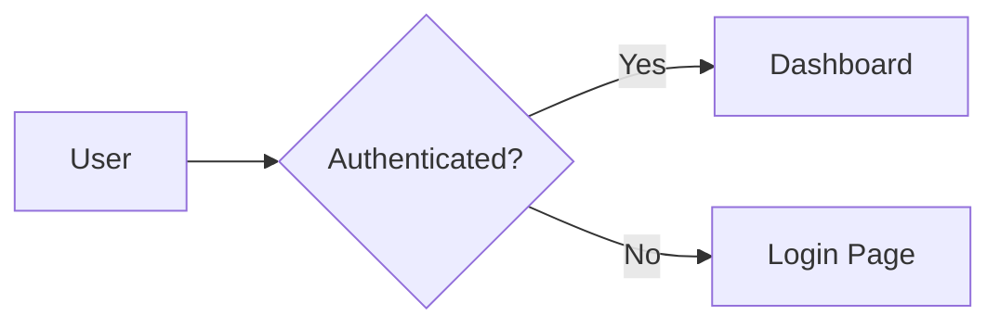
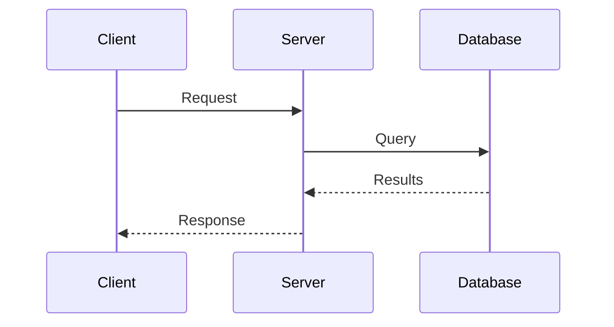
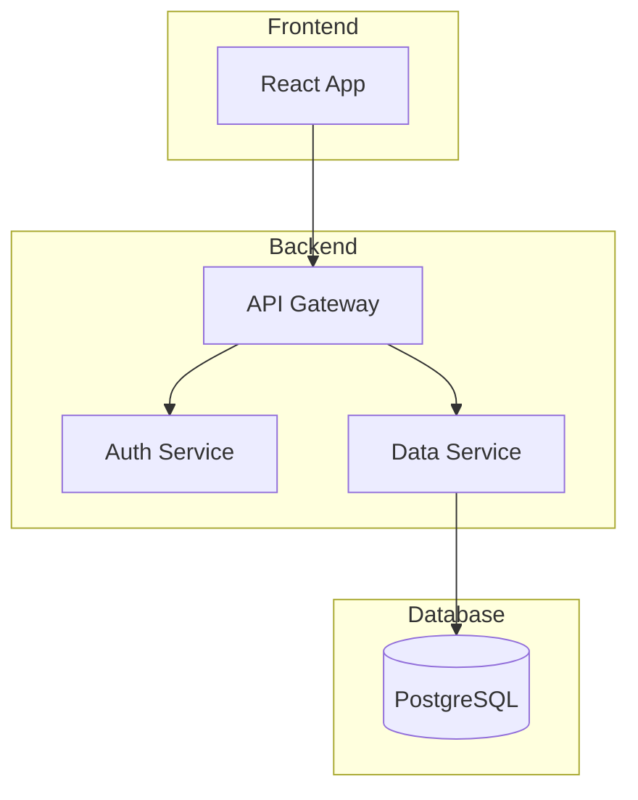

# /diagram - Diagram Generation & Export

Generate and export diagrams from Mermaid definitions for GitHub README and blog posts.

**Agent:** writer (or direct skill invocation)
**Skill:** diagram-generation
**Output:** Inline or exported to specified location

---

## Quick Start

### Create Diagram
```
/diagram create a flowchart showing the authentication flow
```

### Export Existing
```
/diagram export README.md diagrams to PNG
```

---

## When to Use

**Use /diagram when:**
- Creating flowcharts, sequence diagrams, architecture diagrams
- Exporting Mermaid to PNG/SVG for blog posts
- Generating GitHub README diagrams
- Visualizing processes, relationships, or structures

**Don't use if:**
- Need complex UML modeling → use PlantUML directly
- Need hand-drawn style → use Excalidraw

---

## Supported Diagram Types

### Via Mermaid (Primary)
- **Flowcharts** - `flowchart LR/TB/TD`
- **Sequence diagrams** - `sequenceDiagram`
- **Class diagrams** - `classDiagram`
- **State diagrams** - `stateDiagram-v2`
- **Entity Relationship** - `erDiagram`
- **Gantt charts** - `gantt`
- **Git graphs** - `gitGraph`
- **Mind maps** - `mindmap`

### Via Kroki API (Extended)
- PlantUML, D2, Excalidraw, GraphViz, C4

---

## Usage Modes

### Mode 1: GitHub README (Inline)
```
/diagram inline flowchart for authentication

Output: Mermaid code block (GitHub renders natively)
```

### Mode 2: Blog Export (PNG/SVG)
```
/diagram export to PNG for blog post

Output: PNG file for Ghost upload
```

### Mode 3: Batch Extract
```
/diagram extract all diagrams from README.md

Output: Individual PNG/SVG files
```

---

## Script Usage

```bash
# Single file
python skills/diagram-generation/scripts/export-diagram.py input.mmd -o output.png

# From markdown (extracts mermaid blocks)
python skills/diagram-generation/scripts/export-diagram.py README.md --extract -o diagrams/

# With options
python skills/diagram-generation/scripts/export-diagram.py input.mmd -o output.svg --theme dark --width 1200
```

---

## Examples

### Flowchart


### Sequence Diagram


### Architecture Diagram


---

## Agent Routing

```typescript
Task({
  subagent_type: "writer",
  model: "haiku",  // Simple generation task
  prompt: `
Mode: diagram
Skill: diagram-generation

Request: {description}

Instructions:
1. Determine diagram type
2. Generate Mermaid code
3. For blog: export to PNG/SVG
4. For GitHub: provide inline code

Output format: {inline/exported}
`
})
```

---

## Export Options

| Option | Values | Default |
|--------|--------|---------|
| Format | png, svg, pdf | png |
| Theme | default, dark, forest, neutral | default |
| Width | 600-2000 | 800 |
| Background | transparent, white | white |

---

## Related Commands

- `/write` - Content creation (uses diagrams)
- `/generate-image` - FLUX hero images

---

**Version:** 1.0
**Last Updated:** 2025-12-19
**Framework:** Intelligence Adjacent (IA)
