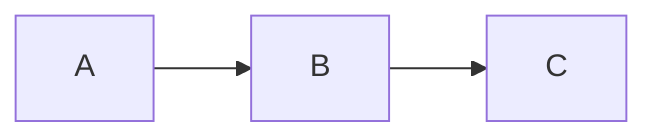
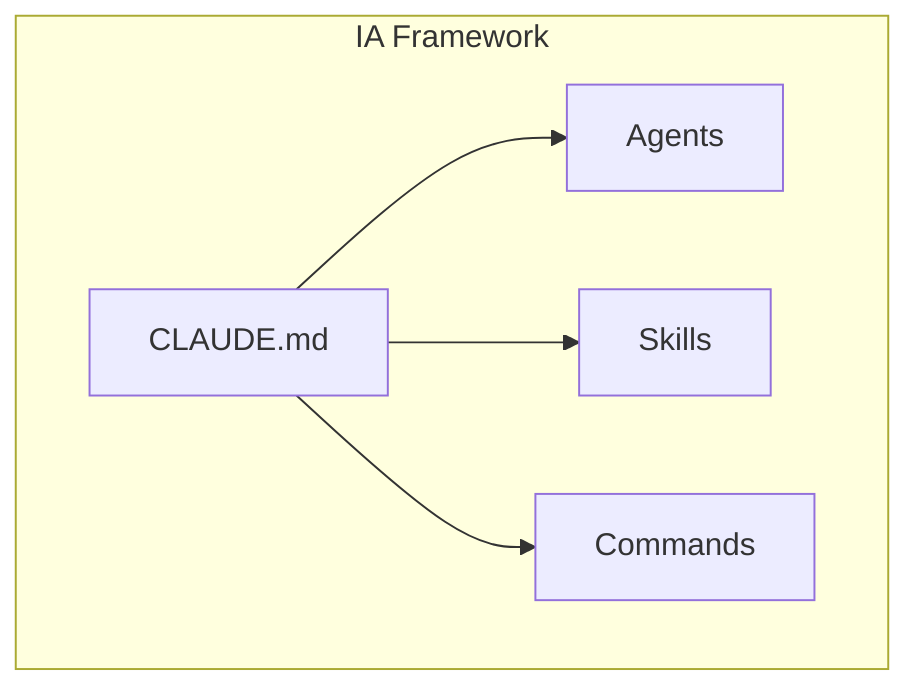
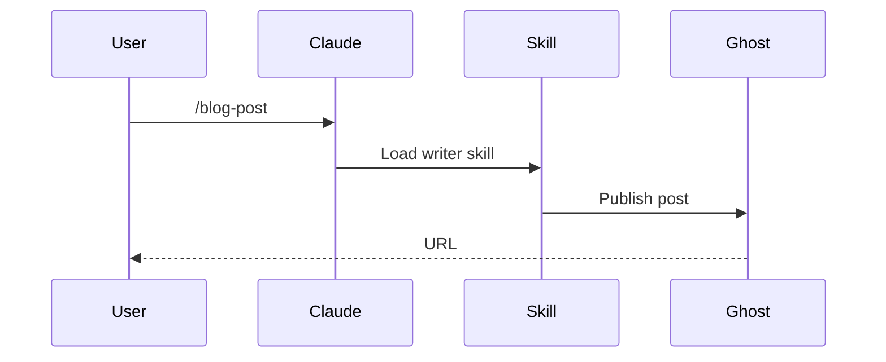
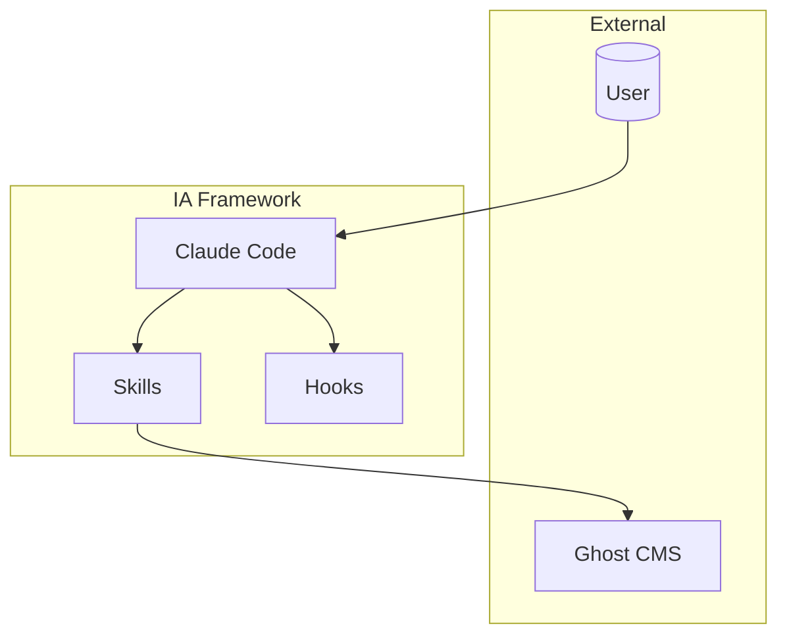

# Diagram Generation Skill

**Purpose:** Generate and export diagrams from text definitions for GitHub README and blog posts.

**Tools:** Mermaid CLI (primary), Kroki API (multi-format)

---

## Quick Start

### Export Mermaid to PNG/SVG

```bash
# Single file
python skills/diagram-generation/scripts/export-diagram.py input.mmd -o output.png

# From markdown (extracts all mermaid blocks)
python skills/diagram-generation/scripts/export-diagram.py README.md --extract -o diagrams/

# With options
python skills/diagram-generation/scripts/export-diagram.py input.mmd -o output.svg --theme dark --width 1200
```

### For GitHub
Use inline Mermaid in markdown - GitHub renders natively:
````markdown

````

### For Blog (Ghost)
Export to PNG/SVG, then upload to Ghost media library.

---

## Supported Diagram Types

### Via Mermaid CLI
- Flowcharts (`flowchart`)
- Sequence diagrams (`sequenceDiagram`)
- Class diagrams (`classDiagram`)
- State diagrams (`stateDiagram-v2`)
- Entity Relationship (`erDiagram`)
- Gantt charts (`gantt`)
- Pie charts (`pie`)
- Git graphs (`gitGraph`)
- Mind maps (`mindmap`)

### Via Kroki API (Extended)
- All Mermaid types
- PlantUML (comprehensive UML)
- D2 (modern syntax)
- Excalidraw (hand-drawn style)
- GraphViz (DOT language)
- C4 diagrams (architecture)
- 20+ more formats

---

## Workflows

### GitHub Documentation
1. Write Mermaid in markdown file
2. Commit - GitHub renders automatically
3. No export needed

### Blog Post with Diagrams
1. Write Mermaid source in `output/blog/[post]/diagrams/`
2. Run export: `python scripts/export-diagram.py diagrams/*.mmd -o images/`
3. Upload PNGs to Ghost
4. Reference in blog post

### Architecture Documentation
1. Create `.mmd` files in `docs/diagrams/`
2. Export for distribution: `scripts/export-diagram.py docs/diagrams/ -o docs/images/`
3. Reference exported images in PDFs, presentations

---

## Tool Setup

### Mermaid CLI (Required)
```bash
npm install -g @mermaid-js/mermaid-cli
# Verify
mmdc --version
```

### Kroki (Optional - for extended formats)
```bash
# Option 1: Use public API (https://kroki.io)
# No setup needed, but rate limited

# Option 2: Self-hosted Docker
docker run -d -p 8000:8000 yuzutech/kroki

# Option 3: With Mermaid support
docker-compose -f skills/diagram-generation/docker-compose.yml up -d
```

---

## Export Options

| Option | Description | Default |
|--------|-------------|---------|
| `-o, --output` | Output file/directory | Same name as input |
| `-f, --format` | Output format (png, svg, pdf) | png |
| `--theme` | Mermaid theme (default, dark, forest, neutral) | default |
| `--width` | Image width in pixels | 800 |
| `--height` | Image height in pixels | 600 |
| `--background` | Background color (transparent, #hex) | white |
| `--extract` | Extract mermaid blocks from markdown | false |
| `--kroki` | Use Kroki API instead of local CLI | false |

---

## Examples

### Flowchart


### Sequence Diagram


### Architecture (C4-style)


---

## Integration with Blog Workflow

The `/blog-post` command can auto-export diagrams:

1. Create diagrams in post directory
2. Blog workflow detects `.mmd` files
3. Exports to PNG automatically
4. Uploads to Ghost with post

---

## References

- `workflows/github-diagram.md` - GitHub inline workflow
- `workflows/blog-export.md` - Blog export workflow
- `reference/mermaid-syntax.md` - Mermaid quick reference
- [Mermaid Documentation](https://mermaid.js.org/)
- [Kroki Documentation](https://kroki.io/)

---

**Skill:** diagram-generation
**Version:** 1.0
**Framework:** Intelligence Adjacent (IA)
