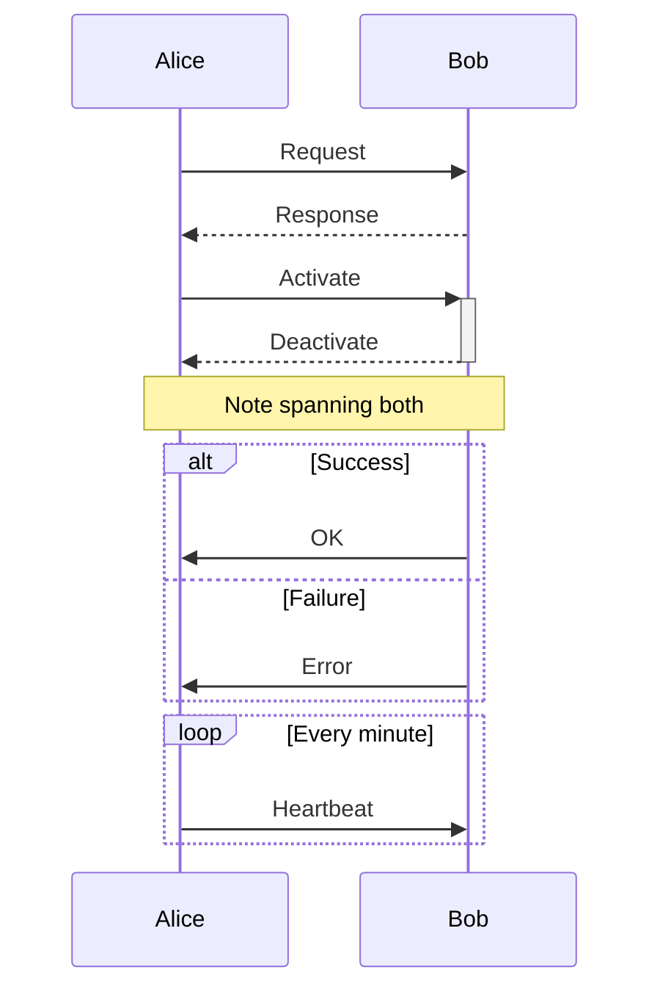
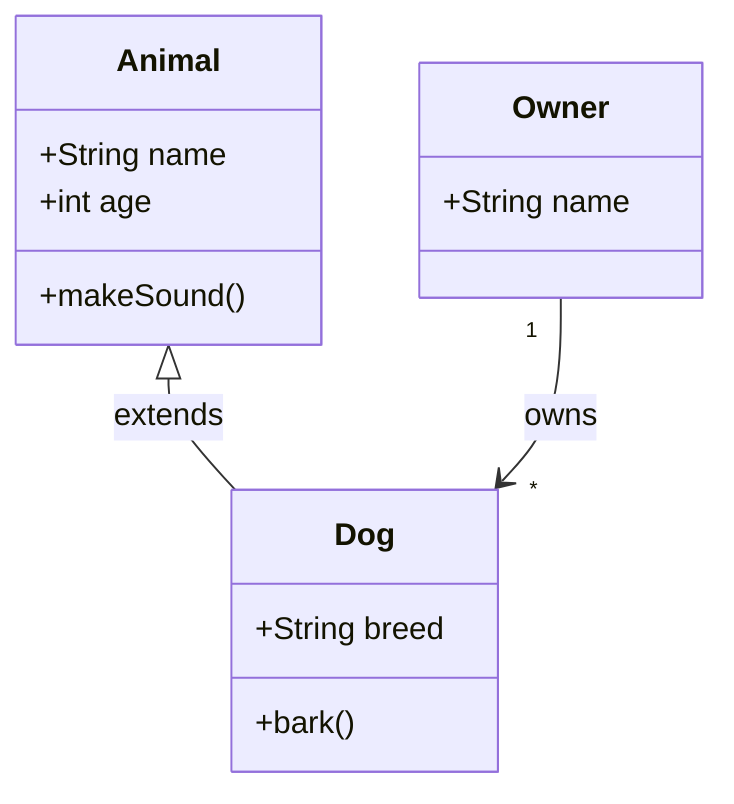
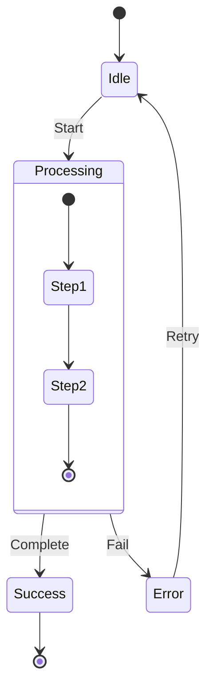
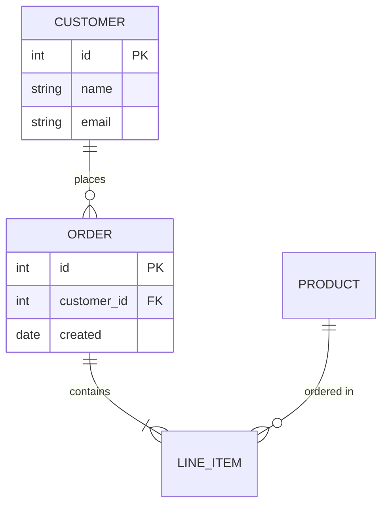
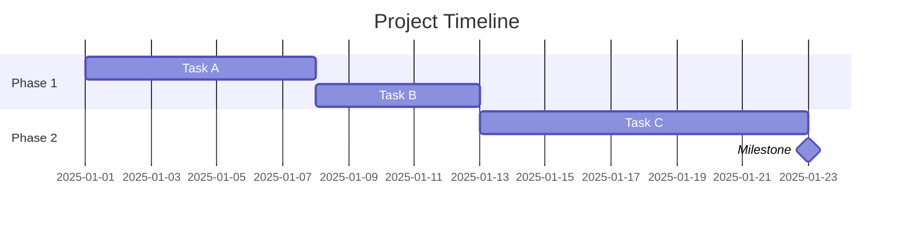
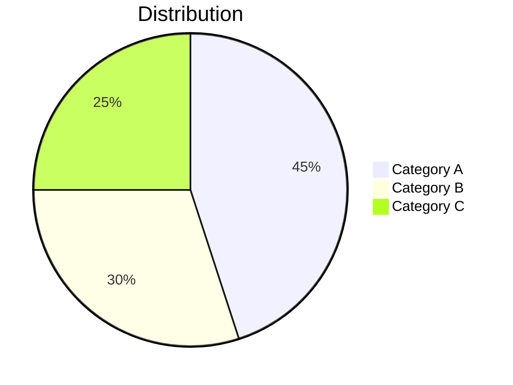
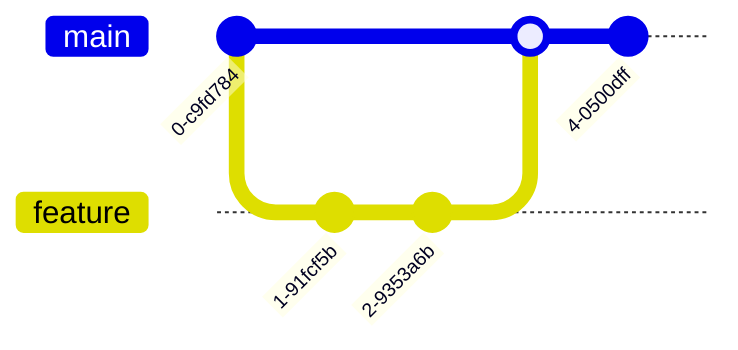
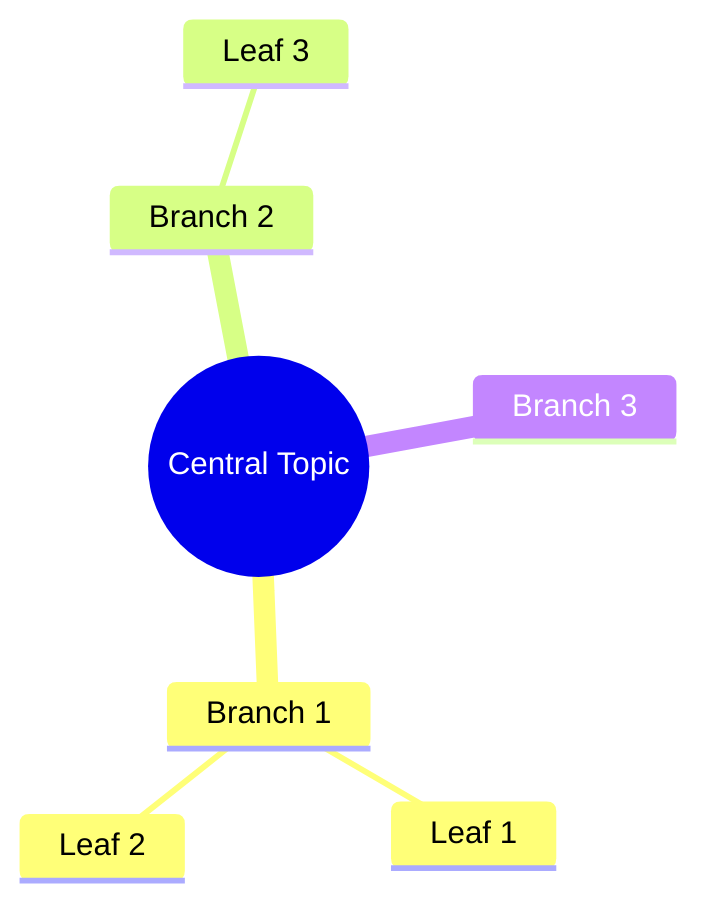
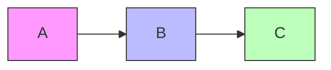
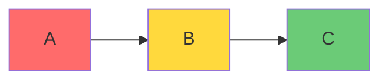

# Mermaid Syntax Quick Reference

Quick reference for common Mermaid diagram syntax.

---

## Flowchart

```mermaid
flowchart TB
    %% Direction: TB (top-bottom), LR (left-right), BT, RL

    %% Nodes
    A[Rectangle]
    B(Rounded)
    C{Diamond}
    D([Stadium])
    E[(Database)]
    F((Circle))

    %% Connections
    A --> B           %% Arrow
    B --- C           %% Line
    C -.-> D          %% Dotted arrow
    D ==> E           %% Thick arrow
    E -->|label| F    %% Labeled

    %% Subgraphs
    subgraph Group["Group Title"]
        G[Node 1]
        H[Node 2]
    end
```

### Node Shapes

| Syntax | Shape |
|--------|-------|
| `[text]` | Rectangle |
| `(text)` | Rounded |
| `{text}` | Diamond |
| `([text])` | Stadium |
| `[(text)]` | Database |
| `((text))` | Circle |
| `[[text]]` | Subroutine |
| `>text]` | Flag |

### Connections

| Syntax | Type |
|--------|------|
| `-->` | Arrow |
| `---` | Line |
| `-.->` | Dotted arrow |
| `==>` | Thick arrow |
| `--text-->` | Labeled |
| `-->|text|` | Labeled (alt) |

---

## Sequence Diagram



### Arrow Types

| Syntax | Type |
|--------|------|
| `->>` | Solid arrow |
| `-->>` | Dotted arrow |
| `-x` | Cross (async) |
| `--x` | Dotted cross |
| `-)` | Open arrow |
| `--)` | Dotted open |

### Activation

| Syntax | Effect |
|--------|--------|
| `->>+` | Activate target |
| `-->>-` | Deactivate target |
| `activate A` | Explicit activate |
| `deactivate A` | Explicit deactivate |

---

## Class Diagram



### Relationships

| Syntax | Type |
|--------|------|
| `<\|--` | Inheritance |
| `*--` | Composition |
| `o--` | Aggregation |
| `-->` | Association |
| `..>` | Dependency |
| `..\|>` | Realization |

### Visibility

| Symbol | Meaning |
|--------|---------|
| `+` | Public |
| `-` | Private |
| `#` | Protected |
| `~` | Package |

---

## State Diagram



---

## Entity Relationship



### Cardinality

| Syntax | Meaning |
|--------|---------|
| `\|\|` | Exactly one |
| `o\|` | Zero or one |
| `}o` | Zero or more |
| `}\|` | One or more |

---

## Gantt Chart



---

## Pie Chart



---

## Git Graph



---

## Mind Map



---

## Styling

### Inline Styles



### Class-based Styles



---

## Themes

Available themes:
- `default` - Standard colors
- `dark` - Dark background
- `forest` - Green tones
- `neutral` - Grayscale

Set via CLI: `mmdc -t dark ...`

---

**Reference:** mermaid-syntax
**Skill:** diagram-generation
