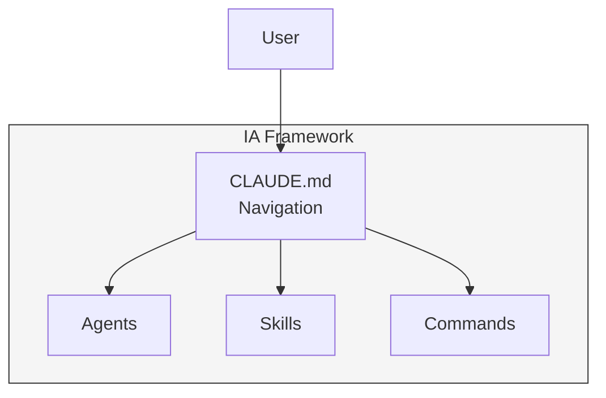

# Blog Diagram Export Workflow

Export diagrams from Mermaid source to PNG/SVG for Ghost blog posts.

---

## Quick Workflow

### 1. Create Diagram Source

Create `.mmd` files in your blog post directory:

```
output/blog/my-post/
├── content.md           # Blog post content
└── diagrams/
    ├── architecture.mmd # Diagram source
    └── flow.mmd
```

### 2. Export to PNG

```bash
cd output/blog/my-post

# Export all diagrams
python ~/.claude/skills/diagram-generation/scripts/export-diagram.py \
    diagrams/*.mmd -o images/ --theme default --width 1000

# Or export single diagram
python ~/.claude/skills/diagram-generation/scripts/export-diagram.py \
    diagrams/architecture.mmd -o images/architecture.png
```

### 3. Upload to Ghost

Option A: **Manual upload**
- Go to Ghost Admin → Settings → Media
- Upload PNG files
- Copy URLs for use in post

Option B: **Via Ghost API** (if configured)
- Use `/blog-post` command which auto-handles uploads

### 4. Reference in Blog Post

```markdown

```

---

## Recommended Settings

### For Blog Posts

```bash
# Clean, readable diagrams
--theme default --width 1000 --background white

# Dark mode posts
--theme dark --width 1000 --background "#1a1a2e"

# Transparent for flexible backgrounds
--theme neutral --width 1000 --background transparent
```

### For Technical Documentation

```bash
# Detailed diagrams
--width 1200 --height 800

# PDF generation
--format pdf --width 1200
```

---

## Integration with /blog-post

The `/blog-post` command can auto-detect and export diagrams:

1. Create diagrams in `diagrams/` subdirectory
2. Run `/blog-post`
3. Command detects `.mmd` files
4. Exports to `images/`
5. Uploads to Ghost with post

---

## Example: Complete Blog Post with Diagram

### Directory Structure

```
output/blog/ia-framework-intro/
├── content.md
├── diagrams/
│   └── framework-overview.mmd
└── images/
    └── framework-overview.png  # Generated
```

### Diagram Source (`framework-overview.mmd`)



### Export Command

```bash
python ~/.claude/skills/diagram-generation/scripts/export-diagram.py \
    diagrams/framework-overview.mmd \
    -o images/framework-overview.png \
    --width 800 --theme default
```

### In Blog Content

```markdown
## Framework Architecture

The IA Framework uses a hierarchical structure...


As shown above, CLAUDE.md serves as the navigation layer...
```

---

## Batch Export

For posts with many diagrams:

```bash
# Export all .mmd files in directory
python ~/.claude/skills/diagram-generation/scripts/export-diagram.py \
    diagrams/*.mmd -o images/

# Extract from markdown and export
python ~/.claude/skills/diagram-generation/scripts/export-diagram.py \
    content.md --extract -o images/
```

---

## Troubleshooting

### "mmdc not found"
```bash
npm install -g @mermaid-js/mermaid-cli
```

### Diagram renders incorrectly
- Check Mermaid syntax at https://mermaid.live/
- Try different theme: `--theme forest`

### Large file sizes
- Use SVG format: `--format svg`
- Reduce dimensions: `--width 600`

---

**Workflow:** blog-export
**Skill:** diagram-generation
