# GitHub Diagram Workflow

Using Mermaid diagrams in GitHub documentation (README, docs, issues, PRs).

---

## GitHub Native Rendering

GitHub automatically renders Mermaid diagrams in markdown. No export needed.

### Basic Usage

````markdown
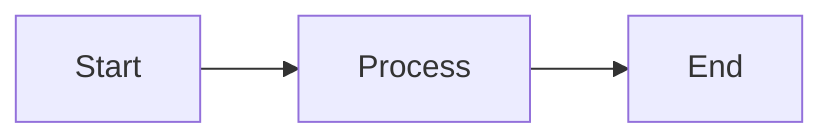
````

Renders directly in:
- README.md
- Documentation files
- Issues and Pull Requests
- Wiki pages

---

## Common Diagram Types

### Flowchart

````markdown
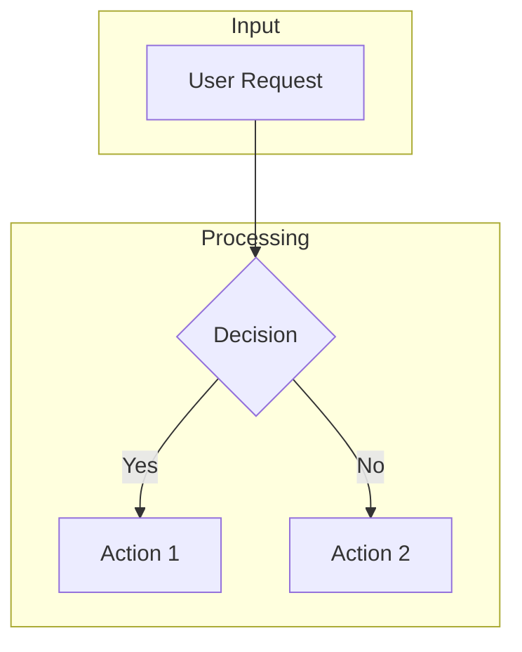
````

### Sequence Diagram

````markdown
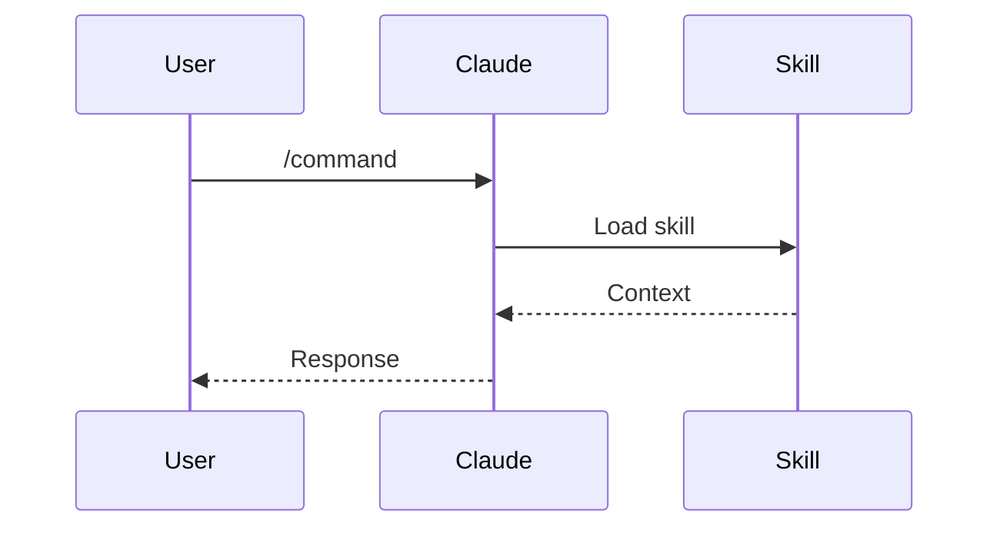
````

### Class Diagram

````markdown
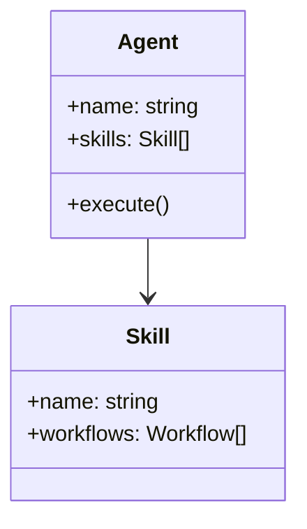
````

### State Diagram

````markdown
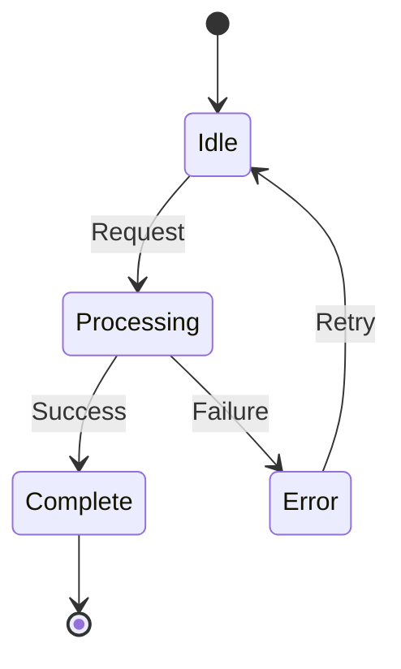
````

### Entity Relationship

````markdown
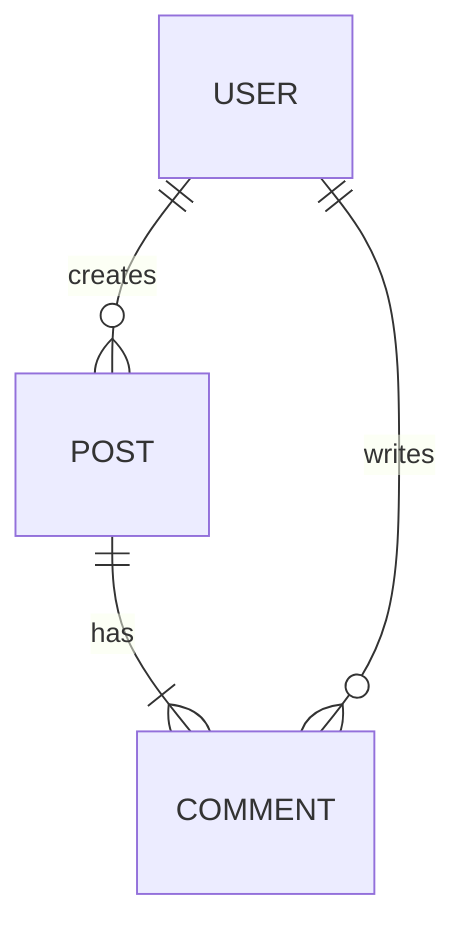
````

---

## Best Practices

### 1. Keep Diagrams Focused

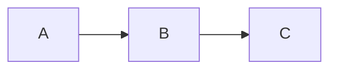

Avoid cramming too much into one diagram.

### 2. Use Subgraphs for Organization

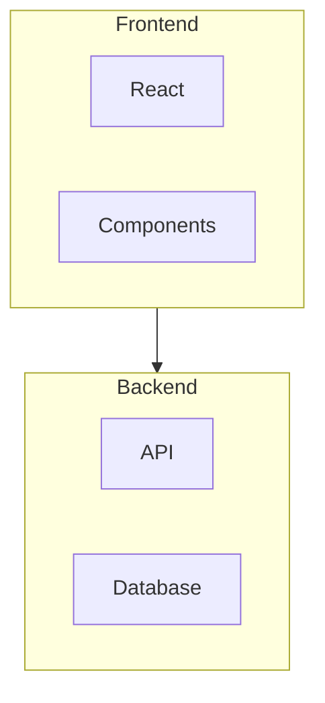

### 3. Add Labels to Edges

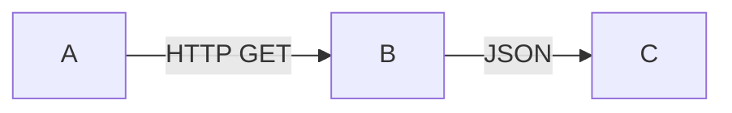

### 4. Use Appropriate Direction

- `TB` (top-bottom) - Hierarchies, processes
- `LR` (left-right) - Sequences, flows
- `BT` (bottom-top) - Rare, specific uses
- `RL` (right-left) - Rare

---

## Styling

### Node Shapes

```
[Rectangle]
(Rounded)
{Diamond}
([Stadium])
[[Subroutine]]
[(Database)]
((Circle))
```

### Colors (via style)

````markdown
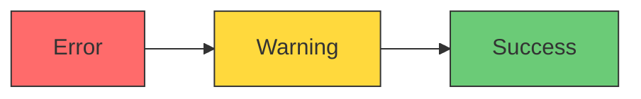
````

---

## When to Export Instead

Export to PNG/SVG when:
- Sharing outside GitHub
- Including in presentations
- Adding to Ghost blog
- Creating PDFs

Use:
```bash
python skills/diagram-generation/scripts/export-diagram.py \
    docs/architecture.mmd -o docs/images/architecture.png
```

---

## Diagram Source Files

For complex diagrams, maintain `.mmd` source files:

```
docs/
├── architecture.md      # References diagram
├── diagrams/
│   └── architecture.mmd # Source (for exports)
```

In markdown:
````markdown
<!-- For GitHub: inline rendering -->
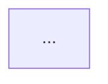

<!-- For other uses: exported image -->

````

---

**Workflow:** github-diagram
**Skill:** diagram-generation
