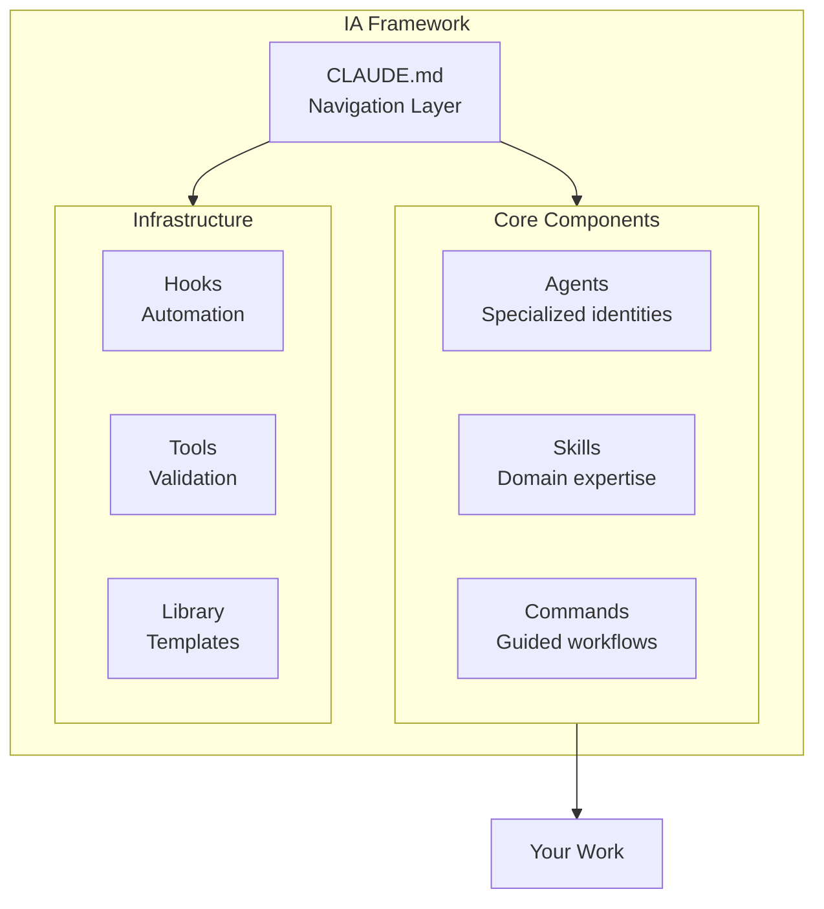
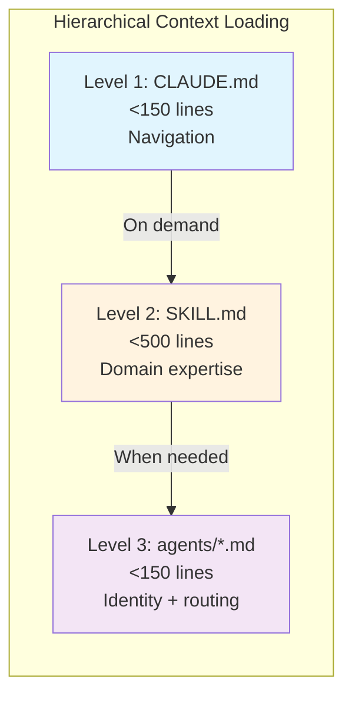

# Intelligence Adjacent (IA) Framework

**Intelligence Adjacent (IA)** is a framework for building AI systems that work alongside human intelligence rather than attempting to replace it.

We believe that orchestration and scaffolding are more important than model intelligence. The goal is upgrading human capabilities, not automation.

---

## Overview



### Core Principles

1. **Intelligence Adjacent** - AI works alongside you, not instead of you
2. **Solve Once, Reuse Forever** - Capture patterns in reusable components
3. **Progressive Context Loading** - Load only what's needed, when needed
4. **File-Based Context** - Everything is a readable, editable file

---

## Quick Start

<details>
<summary><strong>Windows (PowerShell)</strong></summary>

```powershell
# 1. Clone the repository
git clone https://github.com/notchrisgroves/ia-framework.git
cd ia-framework

# 2. Run the installer
.\setup\install.ps1

# 3. Configure your API keys
# Edit ~/.env with your keys (template created by installer)

# 4. Start Claude Code
claude
```

</details>

<details>
<summary><strong>macOS / Linux (Bash)</strong></summary>

```bash
# 1. Clone the repository
git clone https://github.com/notchrisgroves/ia-framework.git
cd ia-framework

# 2. Run the installer
./setup/install.sh

# 3. Configure your API keys
# Edit ~/.env with your keys (template created by installer)

# 4. Start Claude Code
claude
```

</details>

### What the Installer Does

1. Creates a symlink: `~/.claude` -> `<repo>/.claude`
2. Copies `.env.example` -> `~/.env` (if not exists)
3. Creates user directories: `sessions/`, `plans/`, `output/`
4. Runs verification to confirm setup

---

## Architecture



### Directory Structure

```
ia-framework/
├── README.md                 # You are here
├── LICENSE                   # MIT License
├── setup/                    # Installation scripts
│   ├── install.sh           # Unix installer
│   ├── install.ps1          # Windows installer
│   └── verify-installation.py
│
└── .claude/                  # Framework core (symlinked to ~/.claude)
    ├── CLAUDE.md            # Navigation layer
    │
    ├── docs/                # Architecture documentation
    ├── library/             # Templates, patterns, prompts
    ├── tools/               # Validation scripts
    ├── hooks/               # Automation hooks
    │
    ├── agents/              # Specialized agents (add your own)
    ├── commands/            # Slash commands (add your own)
    └── skills/              # Domain skills (add your own)
```

---

## Core Components

### Agents

Specialized identities that handle specific domains. Create your own in `.claude/agents/`.

### Skills

Domain expertise with progressive context loading. Use the `create-skill` skill to bootstrap new skills.

### Commands

Guided workflows triggered by `/command`. Create your own in `.claude/commands/`.

---

## Creating Your Own Components

### Create a New Skill

```bash
# In Claude Code, use the create-skill skill
"Create a new skill for [your domain]"

# Or manually:
mkdir -p .claude/skills/my-skill
# Create SKILL.md following the template in library/templates/
```

### Create a New Agent

```bash
# Copy the example agent
cp .claude/agents/example-agent.md .claude/agents/my-agent.md
# Edit to define your agent's identity and routing
```

### Create a New Command

```bash
# Copy the example command
cp .claude/commands/example-command.md .claude/commands/my-command.md
# Edit to define your workflow
```

---

## Configuration

### Environment Variables

Create `~/.env` from the template:

```bash
# Required for Claude Code
ANTHROPIC_API_KEY=your-key-here

# Optional integrations
OPENAI_API_KEY=your-key-here
OPENROUTER_API_KEY=your-key-here
```

---

## Updating

```bash
cd ~/repos/ia-framework  # or wherever you cloned
git pull origin main

# Your customizations in agents/, commands/, skills/ are preserved
# Framework core updates automatically via symlink
```

---

## Documentation

| Document | Description |
|----------|-------------|
| [Hierarchical Context Loading](.claude/docs/hierarchical-context-loading.md) | How context is progressively loaded |
| [Agent Format Standards](.claude/docs/AGENT-FORMAT-STANDARDS.md) | How to create agents |
| [File Location Standards](.claude/docs/FILE-LOCATION-STANDARDS.md) | Where files should go |
| [Credential Handling](.claude/docs/CREDENTIAL-HANDLING-ENFORCEMENT.md) | Security best practices |

---

## Contributing

See [CONTRIBUTING.md](CONTRIBUTING.md) for guidelines.

---

## License

MIT License - see [LICENSE](LICENSE) for details.

---

## Acknowledgments

Inspired by [Personal AI Infrastructure (PAI)](https://github.com/danielmiessler/Personal_AI_Infrastructure) and the Claude Code community.

---

**Framework:** Intelligence Adjacent (IA) | **Version:** 1.0.0
